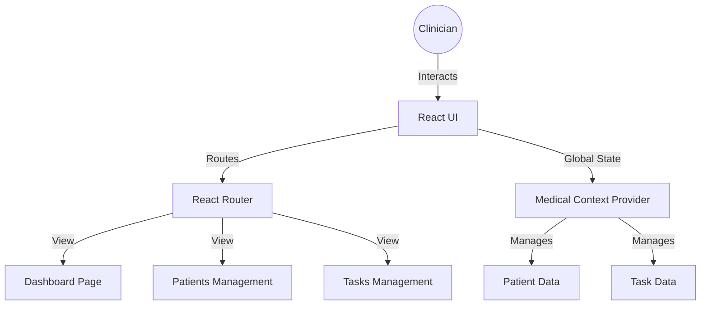

# 🏥 Medical-System: Healthcare Management Dashboard

[](https://react.dev/)
[](https://reactrouter.com/)
[](https://reactjs.org/docs/context.html)

A modern, comprehensive healthcare management system designed to streamline patient tracking, task management, and clinical workflows. Built for high-efficiency medical environments, it provides a centralized dashboard for healthcare professionals.

## 🌟 Overview
Managing patient data and daily clinical tasks can be overwhelming. **Medical-System** provides a unified interface that organizes patient records and staff responsibilities into a single, cohesive digital environment.

### The Core Idea
The system uses a **Decision-First** design approach, surfacing critical patient data and pending tasks immediately upon login to ensure healthcare providers can focus on patient care rather than administrative overhead.

---

## ✨ Key Features

### 📊 Clinical Dashboard
- **Patient Statistics**: Real-time overview of current patient volume and demographics.
- **Task Tracking**: Integrated task management system for clinical staff.
- **Quick Navigation**: Seamless switching between patient records, task lists, and analytics.

### 📂 Management Modules
- **Patient Records**: Centralized database for patient history and status tracking.
- **Task Workflow**: Specialized interface for assigning, prioritizing, and completing clinical tasks.
- **State Persistence**: Uses React Context API to ensure data consistency across the entire application.

### 📱 Responsive Layout
- **Cross-Device Support**: Fully functional on both desktop and mobile devices.
- **Mobile Navigation**: Dedicated bottom navigation for a native app-like experience on smartphones.

---

## 🏗 System Architecture



---

## 🛠 Tech Stack

| Component | Technology |
| :--- | :--- |
| **Framework** | [React](https://react.dev/) (Vite) |
| **Routing** | [React Router DOM](https://reactrouter.com/) |
| **State Management** | React Context API |
| **Styling** | Custom CSS / Tailwind CSS |
| **Icons** | Custom Healthcare Iconography |

---

## ⚙️ Setup & Installation

1. **Clone the Project**:
```bash
git clone https://github.com/santanu949/MEDICAL-SYSTEM-main.git
cd MEDICAL-SYSTEM-main
```

2. **Install Dependencies**:
```bash
npm install
```

3. **Run Development Server**:
```bash
npm run dev
```

---

## 📂 Project Structure
- `src/context/`: Core state management logic (`MedicalContext`).
- `src/pages/`: Page-level components (`Dashboard`, `Patients`, `Tasks`).
- `src/components/layout/`: Shared layout components like `Navbar` and `MobileFooter`.

---

## 📈 Current Status
- **Core Dashboard**: Implemented.
- **Patient Management**: Functional.
- **Task System**: Active.

---

<div align="center">
  <p>© 2026 Medical-System. Empowering Healthcare Professionals.</p>
</div>
